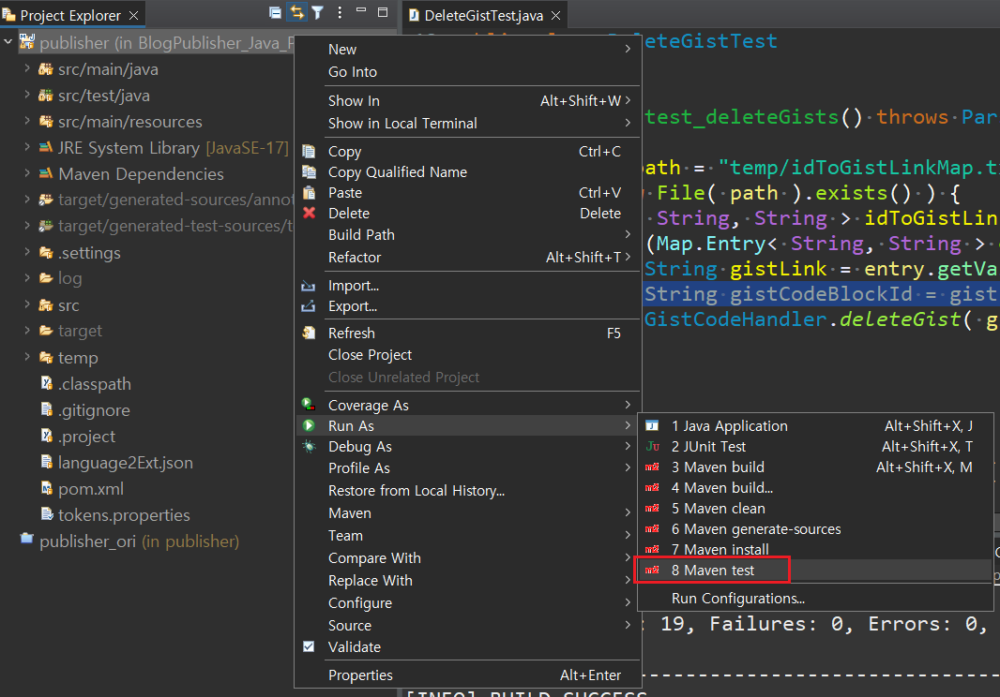
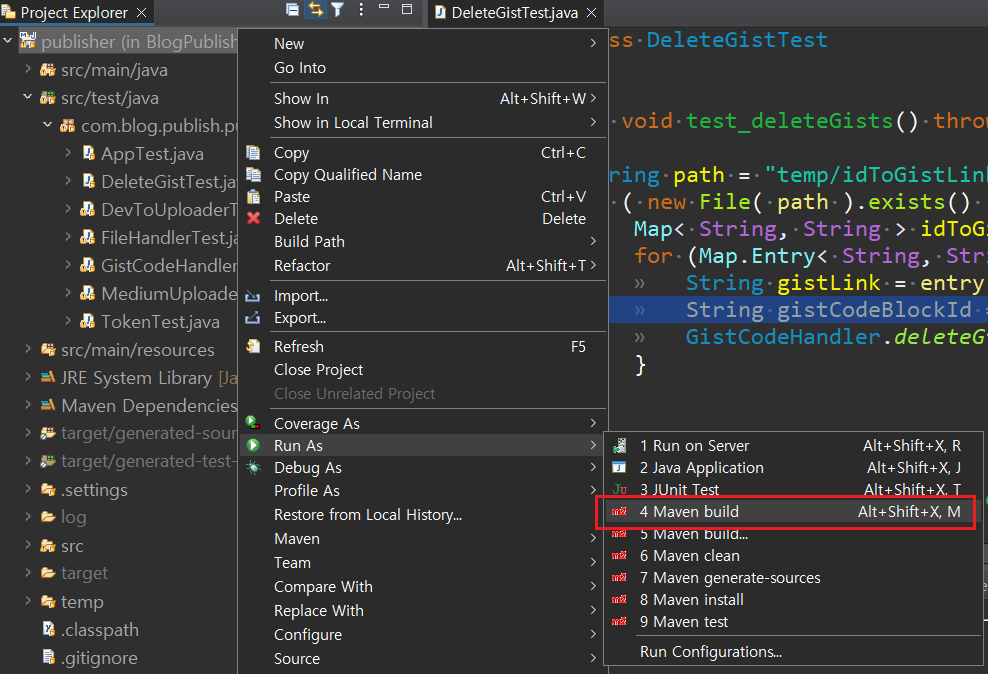
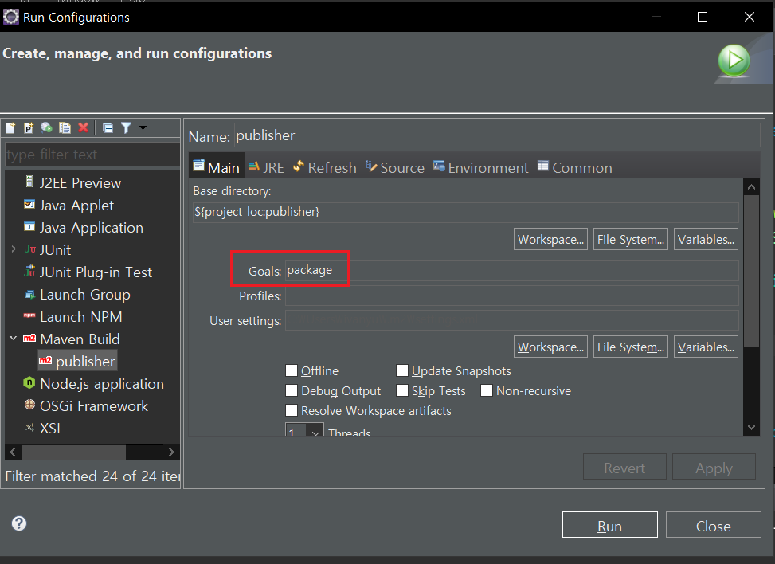

<!-- omit in toc -->
# Blog Publisher

<!-- omit in toc -->
## Detail Guide

<!-- omit in toc -->
## Table of Contents
- [Requirements](#requirements)
- [Installation](#installation)
- [Test](#test)
- [Build (or Package)](#build-or-package)
- [Run](#run)

## Requirements
- Java 17.0.4.1
- Eclipse (2022-06, 4.24.0)

## Installation
- Run the following command
```cmd
git clone https://github.com/ivanyu199012/BlogPublisher_Java_Public.git
```

- Open the project in Eclipse

- Input the tokens in tokens.properties

	tokens.properties
	```properties
	GITHUB_TOKEN=<enter your github token here>
	DEV_TO_TOKEN=<enter your dev to api key here>
	MEDIUM_TOKEN=<enter your medium token here>
	```


## Test
- Click Maven test


## Build (or Package)
- Click Maven build and


- Type "package" in build and click Run:


## Run
Command Format:
```cmd
java -jar publisher-0.0.1-SNAPSHOT.jar <markdown file path> --title <The blog's title> --canonicalUrl <original blog link> --series <series> --sites <sites you wanted to publish to, DEVTO and MEDIUM> --tags <tags> --imageUrl <cover image url> --subtitle <The blog's subtitle>
```

Example:
```cmd
java -jar publisher-0.0.1-SNAPSHOT.jar "C:\Git\...\sample.md" --title "Sample Title" --canonicalUrl https://ivanyu2021.hashnode.dev/correct-steps-to-setup-basic-environment-for-python --series "Python" --sites "DEVTO,MEDIUM" --tags "Python" --imageUrl "https://ivanyu2021.hashnode.dev/_next/image?url=https%3A%2F%2Fcdn.hashnode.com%2Fres%2Fhashnode%2Fimage%2Fupload%2Fv1626249332587%2FK6qFAif_l.png%3Fw%3D1600%26h%3D840%26fit%3Dcrop%26crop%3Dentropy%26auto%3Dcompress%2Cformat%26format%3Dwebp&w=1920&q=75" --subtitle "Sample Subtitle"
```